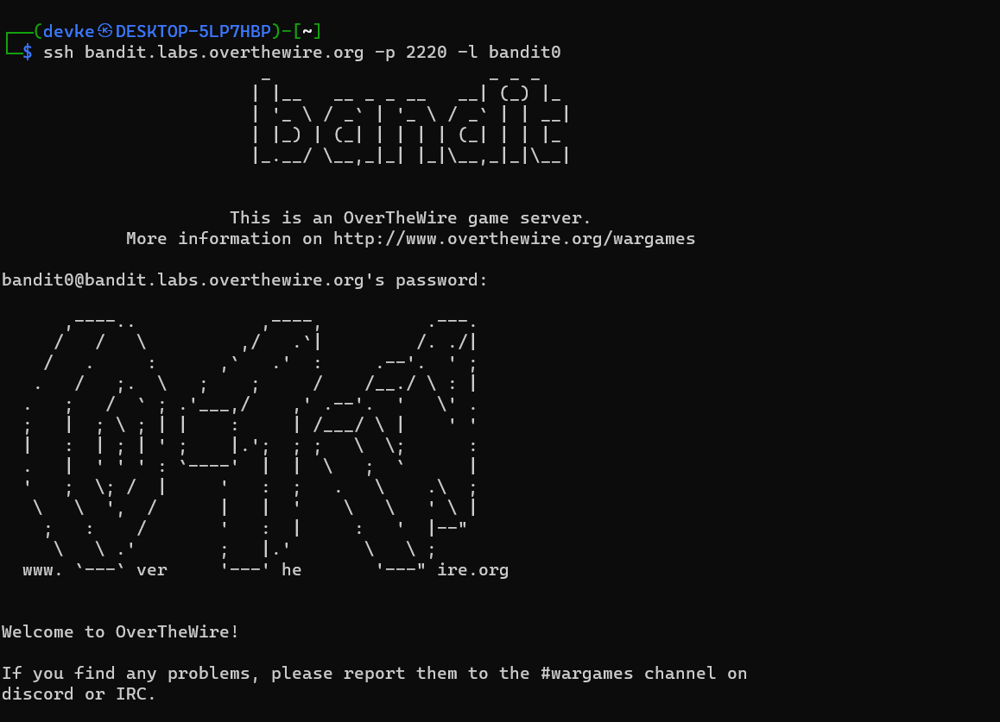

### Level-0 Solution
```bash
ssh bandit.labs.overthewire.org -p 2220 -l bandit0
```
Password: bandit0

### Level-0 Explanation
This level is very simple. We are given the password for the next level in the description. We can use the password to login to the next level.

#### Resources
- [WikiHow SSH](https://www.wikihow.com/Use-SSH)
- [Change username in ssh](https://superuser.com/questions/306152/change-default-username-when-ssh-to-another-pc)
