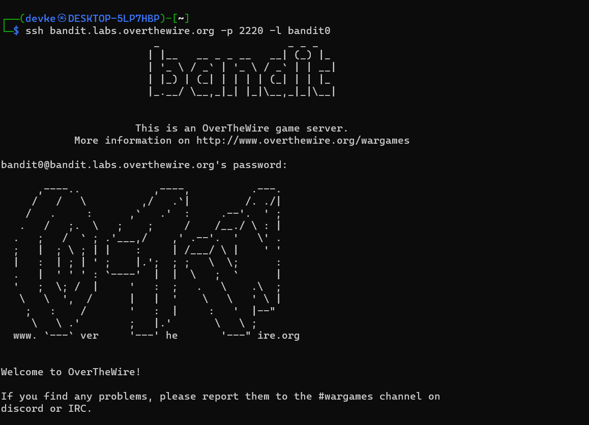

### Level-0 Solution
```bash
ssh bandit.labs.overthewire.org -p 2220 -l bandit0
```
<p>
<details>
<summary>Password (Spoiler Alert).</summary>
<pre><code>bandit0</code></pre>
</details>
</p>

### Level-0 Explanation
- `ssh bandit.labs.overthewire.org -p 2220 -l bandit0` : Login to the server with the given credentials.

