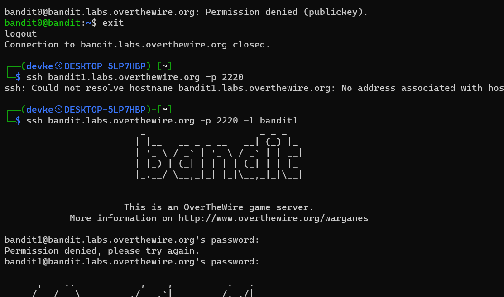

### Level-1 Solution
```bash
> ls -a
> cat readme // Copy the password
> exit
> ssh bandit.labs.overthewire.org -p 2220 -l bandit1
```
<p>
<details>
<summary>Password (Spoiler Alert).</summary>
<pre><code>NH2SXQwcBdpmTEzi3bvBHMM9H66vVXjL</code></pre>
</details>
</p>

### Level-1 Explanation
- `ls -a` : List all files including hidden files.
- `cat readme` : Read the contents of the file.
- `exit` : Exit the current session.
- `ssh bandit.labs.overthewire.org -p 2220 -l bandit1` : Login to the server with the given credentials.

