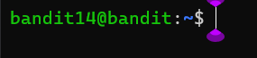

### Level-14 Solution
```bash
> cat sshkey.private
> copy the contents of the file
> exit
> touch sshkey.private
> nano sshkey.private
> paste the contents of the file
> chmod 700 sshkey.private
> ssh bandit14@bandit.labs.overthewire.org -p 2220 -i sshkey.private
> cd /etc/bandit_pass
> cat bandit14
```
<p>
<details>
<summary>Password (Spoiler Alert).</summary>
<pre><code>fGrHPx402xGC7U7rXKDaxiWFTOiF0ENq</code></pre>
</details>
</p>

### Level-14 Explanation
In this level we do something different, we obtain a private key which is used to login to the next level. We can use the private key to login to the next level using the `-i` flag. The `-i` flag is used to specify the identity file (private key) to be used for authentication. The private key is stored in the file `sshkey.private`. We can use the `cat` command to view the contents of the file. We can copy the contents of the file and paste it in a new file using the `nano` command. We can then use the `chmod` command to change the permissions of the file to `700` so that only the owner can read, write and execute the file. We can then use the `ssh` command to login to the next level using the private key. After login change the directory to `/etc/bandit_pass` and use the `cat` command to view the contents of the file `bandit14`. This is the password for the bandit14 user.
