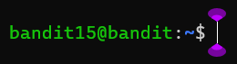

### Level-11 Solution
```bash
> nc localhost 30000
> previous level password
> ctrl+c
> ssh bandit.labs.overthewire.org -p 2220 -l bandit15
```
<p>
<details>
<summary>Password (Spoiler Alert).</summary>
<pre><code>jN2kgmIXJ6fShzhT2avhotn4Zcka6tnt</code></pre>
</details>
</p>

### Level-15 Explanation
The nc command is used to open a TCP connection to the given host and port. In this case, we are connecting to localhost on port 30000. The previous level password is then entered. The connection is then closed with ctrl+c. The ssh command is then used to connect to the bandit15 user on the bandit.labs.overthewire.org server on port 2220. The password is the password obtained from the previous level.

