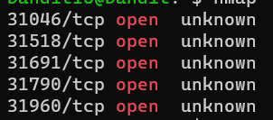
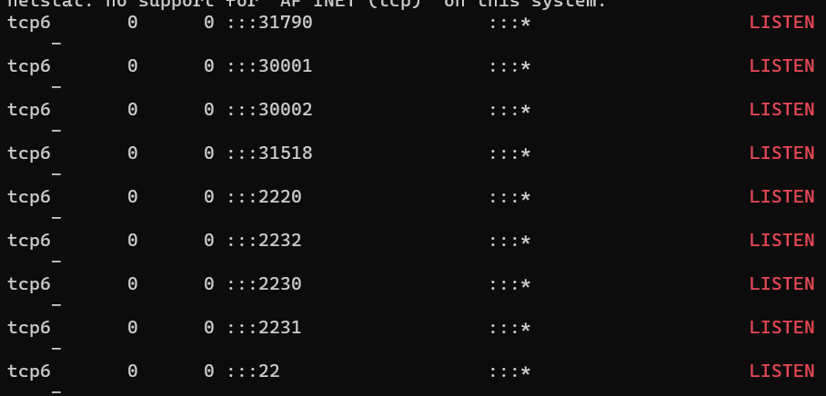

### Level-17 Solution
```bash
> nmap localhost -p 31000-32000 | grep open

// i found on more command on google to find open ports i.e netstat
> netstat -tulpn | grep LISTEN

TUKKA( guess ) : 31790 // as it appeared in both commands :)
> openssl s_client -quiet -connect localhost:31790
> // give last level password   
> // press enter, u will get ssh private key
> exit
> nano sshkey.private // copy the key and save it in a file
> ssh bandit17@bandit.labs.overthewire.org -p 2220 -i sshkey.private
```


<p>
<details>
<summary>Password (Spoiler Alert).</summary>
<pre><code>JQttfApK4SeyHwDlI9SXGR50qclOAil1</code></pre>
</details>
</p>

### Level-17 Explanation
1. nmap is a network scanner, it scans for open ports on a given host.
2. grep is a command line utility for searching plain-text data sets for lines that match a regular expression. 
3. netstat is a command-line network utility tool that displays network connections for Transmission Control Protocol, routing tables, and a number of network interface and network protocol statistics.

