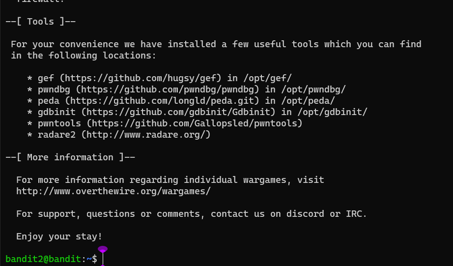

### Level-2 Solution
```bash
> ls -a
> cat .\- // Searched how to cat dash named files, copy the password.
> exit
> ssh bandit.labs.overthewire.org -p 2220 -l bandit2
```
<p>
<details>
<summary>Password (Spoiler Alert).</summary>
<pre><code>rRGizSaX8Mk1RTb1CNQoXTcYZWU6lgzi</code></pre>
</details>
</p>

### Level-2 Explanation
- `ls -a` : List all files including hidden files.
- `cat .\-` : Read the contents of the file.
- `exit` : Exit the current session.
- `ssh bandit.labs.overthewire.org -p 2220 -l bandit2` : Login to the server with the given credentials.

