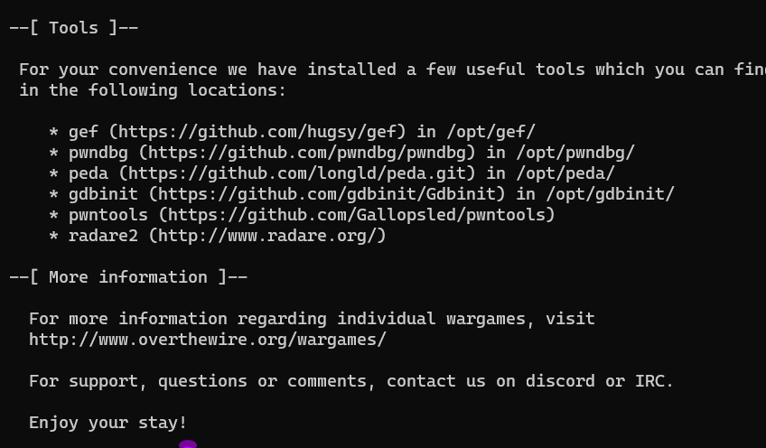

### Level-3 Solution
```bash
> cd ../bandit2
> cat spaces/ in/ the/ filename // Copy the password
> exit
> ssh bandit.labs.overthewire.org -p 2220 -l bandit3
```
<p>
<details>
<summary>Password (Spoiler Alert).</summary>
<pre><code>aBZ0W5EmUfAf7kHTQeOwd8bauFJ2lAiG</code></pre>
</details>
</p>

### Level-1 Explanation
- `cd ../bandit2` : Change directory to the parent directory and then to the bandit2 directory.
- `cat spaces/ in/ the/ filename` : Read the contents of the file.
- `exit` : Exit the current session.
- `ssh bandit.labs.overthewire.org -p 2220 -l bandit3` : Login to the server with the given credentials.

