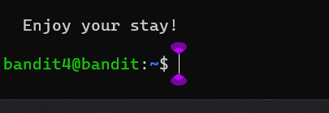

### Level-4 Solution
```bash
> ls -a
> cd inhere/
> ls -a
> cat .hidden // Copy the password
> exit
> ssh bandit.labs.overthewire.org -p 2220 -l bandit4
```
<p>
<details>
<summary>Password (Spoiler Alert).</summary>
<pre><code>2EW7BBsr6aMMoJ2HjW067dm8EgX26xNe</code></pre>
</details>
</p>

### Level-4 Explanation
- `ls -a` : List all files including hidden files.
- `cd inhere/` : Change directory to the inhere directory.
- `ls -a` : List all files including hidden files.
- `cat .hidden` : Read the contents of the file.
- `exit` : Exit the current session.
- `ssh bandit.labs.overthewire.org -p 2220 -l bandit3` : Login to the server with the given credentials.
