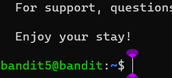
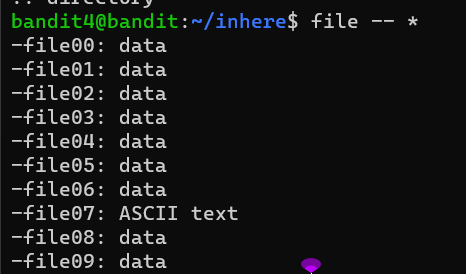

### Level-5 Solution
```bash
> cd inhere/
> ls -a
> cat ./-file07 // look into all files and get human-readable password
> exit
> ssh bandit.labs.overthewire.org -p 2220 -l bandit5
```
<p>
<details>
<summary>Password (Spoiler Alert).</summary>
<pre><code>lrIWWI6bB37kxfiCQZqUdOIYfr6eEeqR</code></pre>
</details>
</p>

### Level-5 Explanation
- `cd inhere/` : Change directory to the inhere directory.
- `ls -a` : List all files in the directory.
- `cat ./-file07` : Read the contents of the file.
- `exit` : Exit the current session.
- `ssh bandit.labs.overthewire.org -p 2220 -l bandit5` : Login to the server with the given credentials.


### Optimized Solution from Internet
```bash
> cd inhere/
> find -- * // find all files and type their contents
> cat ./-file07 // look into all files and get human-readable password
```
