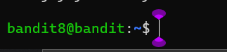

### Level-8 Solution
```bash
> find . grep data.txt
> grep millionth data.txt
> exit
> ssh bandit.labs.overthewire.org -p 2220 -l bandit8
```
<p>
<details>
<summary>Password (Spoiler Alert).</summary>
<pre><code> TESKZC0XvTetK0S9xNwm25STk5iWrBvP</code></pre>
</details>
</p>

### Level-5 Explanation
- `find . grep data.txt` : Find the file with the name data.txt in the current directory.
- `grep millionth data.txt` : Search for the word millionth in the file data.txt.
- `exit` : Exit the current session.
- `ssh bandit.labs.overthewire.org -p 2220 -l bandit8` : Login to the server with the given credentials.

